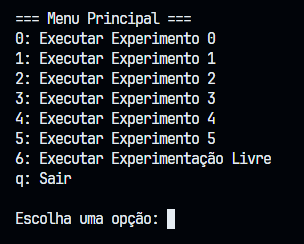
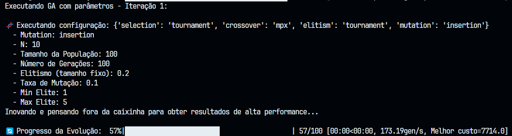

# IA-AlgoritmosGeneticos

## Equipe: 
    - Guilherme Girão Alves
    - Lucas Gabriel
    - Carlos Samuel

## Requisito para a Execução:
    - Python 3

## Guia de novo usuário:
### Caso prefira instalar somente as bibliotecas selecionadas:
    - pip install matplotlib
    - pip install pandas
    - pip install jupyter
    - pip install numpy

### Caso prefira instalar todas:
    - pip install -r requirements.txt

## Como rodar a main?
No terminal no projeto, rode:
```shell
$ python main.py
```

E irá aparecer o menu para escolher qual experimento rodar ou se prefere rodar a execução de forma livre. Para verificar os gráficos e análises comparativas, você pode ir na pasta `/results`, ir no notebook do experimento desejado e trocar o arquivo na variável `caminho_csv`. Os arquivos `/results/resultados_experimento[0-5]MOCADO.csv` são os arquivos os quais usamos nos nossos experimentos e obtivemos os resultados.



